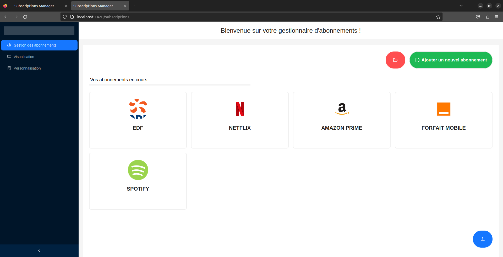
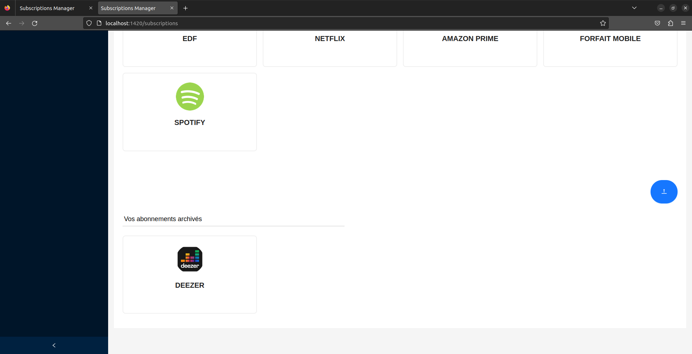
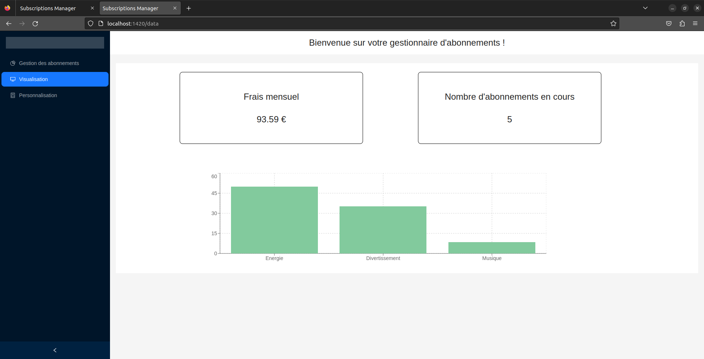
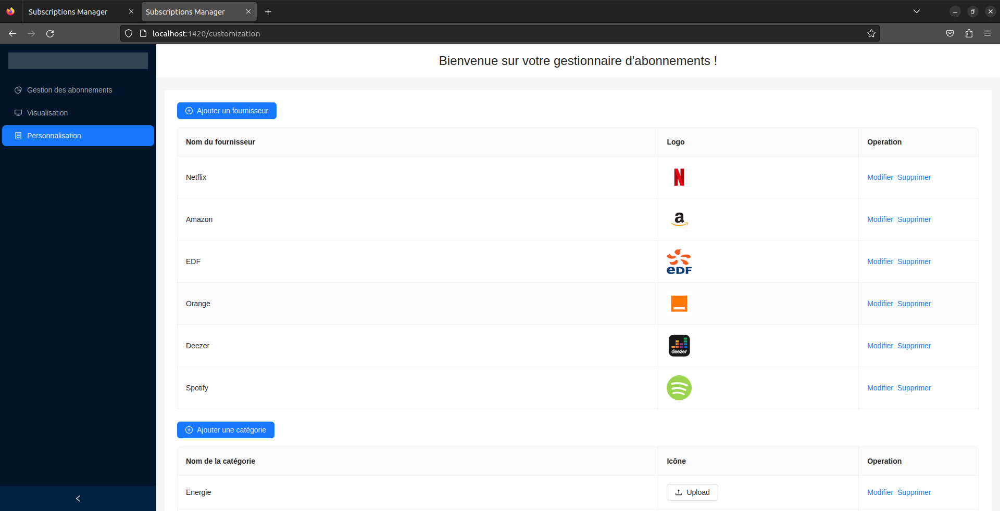

# Subscription Manager

This repo is a small web app, with a React frontend, a backend written in Rust (Rocket framework) and Postgres database. Its goal is to be able to track the money you spent on subscriptions (Netflix, Spotify...) each month. The fontend uses Tauri (the Rust "Electron"), so it can also be displayed as a desktop app. The Tauri part has not been dockerized.

It is a personnal project initially started improve my knowledge of Rust (and also React, but that was not the main goal).

Many things could be improved, but I was starting to get bored by the project so I decided to leave it like this.

Here is what the application looks like:

## Run the project

See BUILD.md file for more instructions on how to run the project
